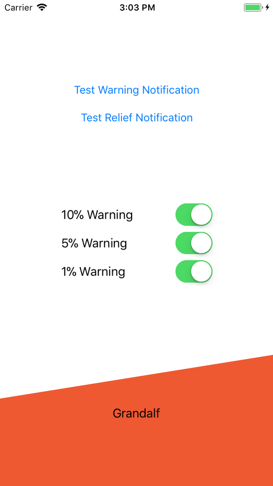
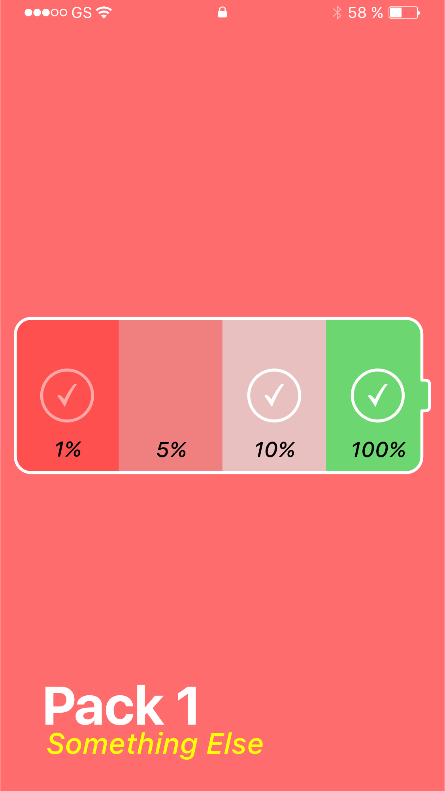
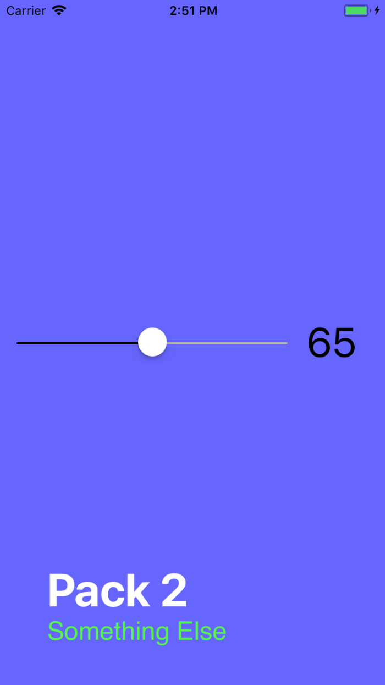

# Save Me From The Light

A fun little app that cries out to you when your battery runs low. Your phone needs you to survive!

	

Includes catch phrases such as...
- *"Please... I can see the light"*
- *"I need... an outlet"*
- *"Tell Siri I love her"*
- *"My addiction... to current... must be solved."*

Additionally, a number of voice packs are available, with more to be added in the future.
- Grandalf *(an old, grumpy man)*
- 8Bit *(Chiptunes but not really)*

## Design

Currently, the application has a barebones, functional design:

	

See the `newdesign` branch for progress on the new design. Some ideas are previewed below:

 

